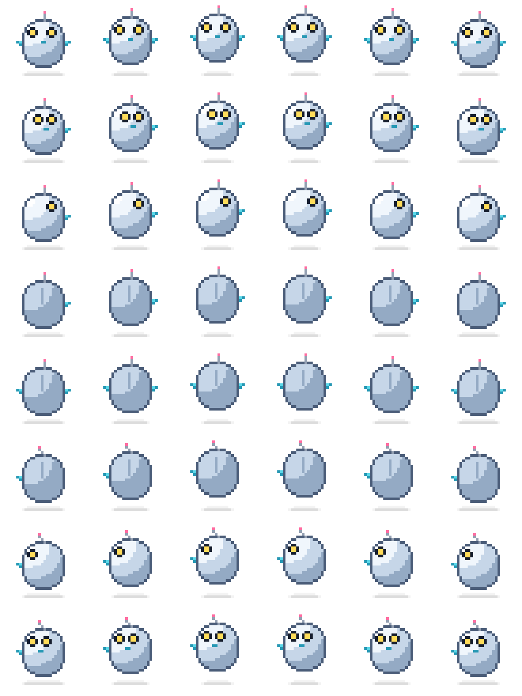

# Friendly Robot — Sprite Sheet

A minimal, bright, human-friendly hovering robot for angled top-down games.



## Files

| File | Purpose |
| --- | --- |
| `robot.png` | The sprite sheet — drop this in your game. |
| `robot_preview.png` | 6× upscaled (nearest-neighbor) preview for inspection. Do **not** ship this. |
| `generate_robot.py` | Generator script. Edit and re-run to tweak colors, proportions, or per-direction details. |

## Sheet spec

- **Sheet size:** 192 × 256 px
- **Cell size:** 32 × 32 px
- **Grid:** 6 columns × 8 rows
- **Format:** PNG with alpha (RGBA, no premultiplied alpha)
- **Pivot:** top-left of cell. The robot is horizontally centered in each cell; the ground/shadow sits near the bottom (`y ≈ 27`).

### Frame layout

Rows are directions; columns are animation frames.

```
        col 0  col 1  col 2  col 3  col 4  col 5
row 0:  S     S     S     S     S     S       (facing camera / down)
row 1:  SE    SE    SE    SE    SE    SE
row 2:  E     E     E     E     E     E       (facing right)
row 3:  NE    NE    NE    NE    NE    NE
row 4:  N     N     N     N     N     N       (facing away / up)
row 5:  NW    NW    NW    NW    NW    NW
row 6:  W     W     W     W     W     W       (facing left)
row 7:  SW    SW    SW    SW    SW    SW
```

**Frame index = `row * 6 + col`.**

### Animation

There is one animation per direction: a 6-frame hover/walk loop.

- The body bobs `0, -1, -2, -2, -1, 0` pixels per frame (negative = up).
- The ground shadow shrinks/grows inversely so the robot reads as floating.
- Recommended playback: **10–12 fps**, looping. Use the same frame index across directions when changing facing to avoid pops.

## Direction conventions

Direction is determined by the robot's movement/facing vector, mapped to the nearest of 8 compass headings:

| Row | Direction | Angle (deg, 0 = +x / right, CCW) |
| --- | --- | --- |
| 0 | S | 270 (down) |
| 1 | SE | 315 |
| 2 | E | 0 (right) |
| 3 | NE | 45 |
| 4 | N | 90 (up) |
| 5 | NW | 135 |
| 6 | W | 180 (left) |
| 7 | SW | 225 |

If your engine uses screen-y-down coordinates: S is "moving toward the bottom of the screen", N is "moving toward the top".

## Usage

### Phaser 3

```js
// Preload
this.load.spritesheet('robot', 'assets/robot.png', {
  frameWidth: 32,
  frameHeight: 32,
});

// Animations — one per direction
const DIRS = ['S', 'SE', 'E', 'NE', 'N', 'NW', 'W', 'SW'];
DIRS.forEach((dir, row) => {
  this.anims.create({
    key: `robot-walk-${dir}`,
    frames: this.anims.generateFrameNumbers('robot', {
      start: row * 6,
      end: row * 6 + 5,
    }),
    frameRate: 10,
    repeat: -1,
  });
});

// Spawn and play
const robot = this.add.sprite(100, 100, 'robot', 0);
robot.play('robot-walk-S');

// Switch direction (e.g. from a velocity vector)
function dirFromVelocity(vx, vy) {
  // screen-y-down: invert vy for compass angle
  const angle = Math.atan2(-vy, vx);          // radians, 0 = right, CCW
  const idx = Math.round(((angle + Math.PI * 2) % (Math.PI * 2)) / (Math.PI / 4)) % 8;
  // idx: 0=E, 1=NE, 2=N, 3=NW, 4=W, 5=SW, 6=S, 7=SE — remap to our row order
  return ['E', 'NE', 'N', 'NW', 'W', 'SW', 'S', 'SE'][idx];
}
robot.play(`robot-walk-${dirFromVelocity(vx, vy)}`, true); // `true` = ignore if already playing
```

### Pixel-perfect rendering

This is pixel art — disable texture smoothing so it doesn't blur at scale.

```js
// Phaser 3 game config
const config = {
  pixelArt: true,         // disables antialiasing on all textures
  roundPixels: true,      // snaps sprite positions to integer pixels
  // ...
};
```

For other engines: set the texture filter to **nearest** (not linear/bilinear) and snap sprite positions to whole pixels.

### Other engines

The PNG is engine-agnostic. Common settings:

- **Godot 4:** Import the PNG with `filter = Nearest`. Use an `AnimatedSprite2D` with a `SpriteFrames` resource, or `AtlasTexture` regions of 32×32.
- **Unity:** Set `Filter Mode = Point (no filter)`, `Compression = None`, `Pixels Per Unit = 32`. Slice the sprite sheet as a 6×8 grid.
- **Love2D / Pico-8 / custom:** Each frame is at `(col * 32, row * 32, 32, 32)`.

## Regenerating / customizing

The sprite sheet is generated procedurally from `generate_robot.py`. Re-run after editing:

```sh
pip install Pillow
python3 generate_robot.py
```

Things you can tweak near the top of the script:

- **Palette constants** (`BODY`, `ACCENT`, `EYE`, `ANTENNA_TIP`, etc.) — swap colors for variants (e.g. a red enemy bot).
- **`BOB`** — bob offsets per frame. Try `[0, -1, -2, -3, -2, -1]` for a higher hop, or `[0, 0, -1, -1, 0, 0]` for a subtler idle.
- **`DIR_CONFIG`** — per-direction eye positions, mouth, antenna lean, and which arm is visible.
- **`in_body()`** — change `RX`, `RY`, or `N_EXP` to reshape the silhouette (rounder, taller, boxier).

To add more frames (e.g. 8-frame loop), change `COLS = 8` and extend `BOB` and `SHADOW_HALF` to 8 entries.

## Credits

Generated with Claude Code.
